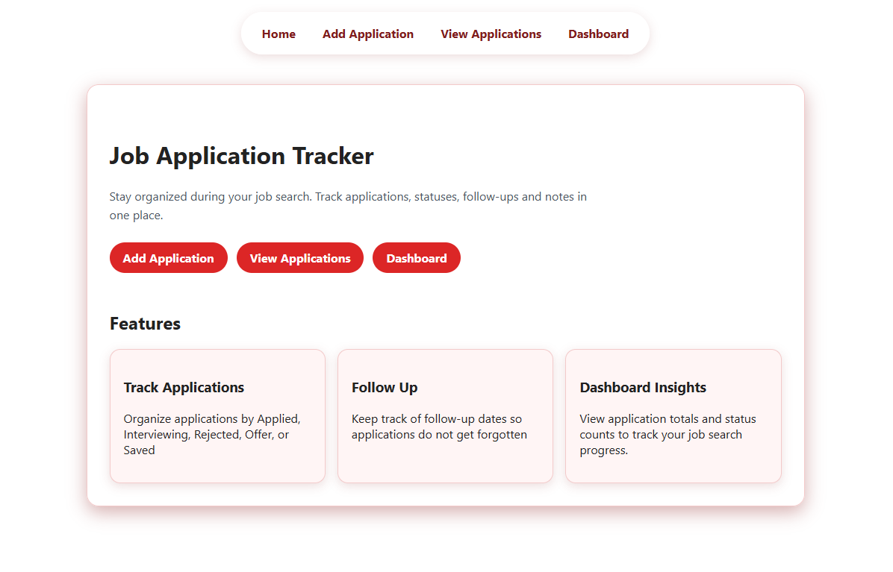
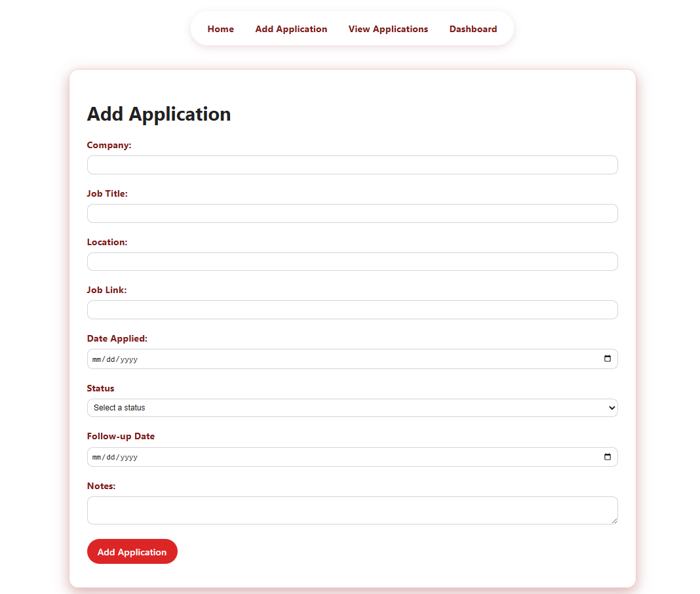
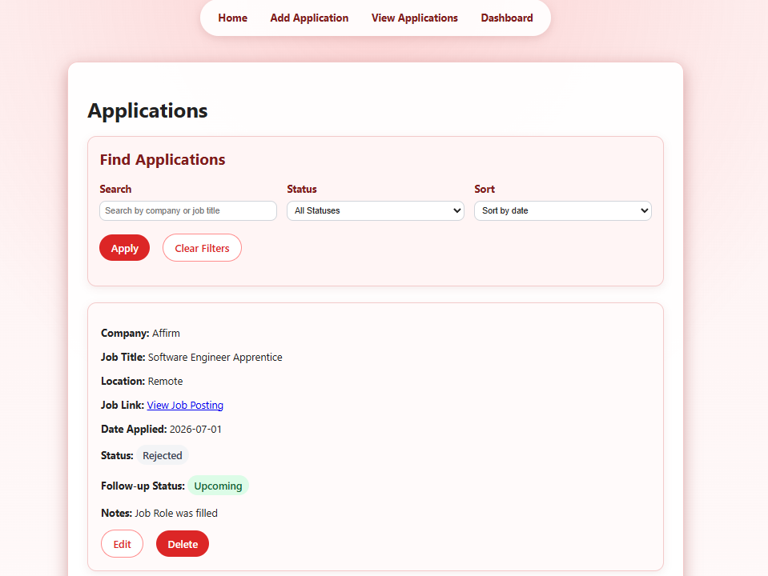
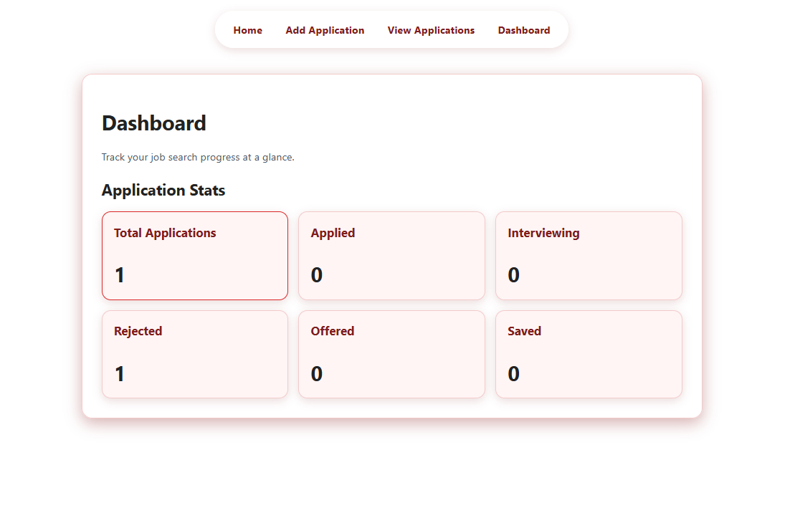

# Job Application Tracker

## Live Demo
https://job-application-tracker-flask.onrender.com

## Overview
The Job Application Tracker is a Flask web application that helps users organize and track job applications, application statuses, follow-up dates, job links, and notes.

Users can add, view, edit, and delete applications. The app also includes search and filtering features, allowing users to search by company or job title and filter applications by status. A dashboard provides a quick overview of the total number of applications and counts by status.

## Project Purpose
I built this project to practice full CRUD functionality, database integration, Flask routing, form handling, template inheritance, and CSS styling in a realistic job-search workflow.

## Features
- Add new job applications
- View all saved applications
- Edit existing applications
- Delete applications
- Search by company or job title
- Filter applications by status
- Sort applications by date applied and follow-up date
- Track follow-up dates and notes
- Display follow-up status labels for overdue, due today, upcoming, and missing follow-up dates
- Display status and follow-up badges
- View dashboard statistics
- View dashboard status breakdown chart with counts and percentages
- Responsive layout for smaller screens

## Tech Stack
- Python
- Flask
- SQLite
- HTML
- CSS
- Jinja templating
- Git and GitHub

## Screenshots
### Home Page


### Add Application


### View Applications


### Dashboard


## Installation
Clone the repository:

```bash
git clone https://github.com/DeviWilk3747/job-application-tracker-flask.git
```

Enter the project directory:

```bash
cd job-application-tracker-flask
```

Create a virtual environment:

```bash
python3 -m venv .venv
```

Activate the virtual environment on macOS or Linux:

```bash
source .venv/bin/activate
```

On Windows PowerShell:

```powershell
.venv\Scripts\Activate.ps1
```

Install the required packages:

```bash
python -m pip install -r requirements.txt
```

## How to Run Locally
Start the Flask application:

```bash
python app.py
```

Then open the following address in a browser:

```text
http://127.0.0.1:5000
```

## What I Learned
- How Flask routes handle GET and POST requests
- How to use SQLite to store and retrieve data
- How to build CRUD functionality
- How to use Jinja templates to display dynamic data
- How to validate form inputs
- How to use search and filtering with SQL queries
- How to organize templates with base.html
- How to style a web app with CSS

## Future Improvements
- Add PostgreSQL for production database persistence
- Add user authentication so multiple users can manage their own applications
- Add email or notification reminders for follow-up dates
- Add pagination for larger application lists
- Add application analytics by month and status

## Completed Improvements
- Deployed the app publicly with Render
- Added status badges
- Improved mobile responsiveness
- Added follow-up status labels for overdue, due today, upcoming, and missing follow-up dates
- Added dashboard status breakdown chart showing application counts and percentages 
- Added sorting by date applied and follow-up date
- Added follow-up status badges for overdue, due today, upcoming, and missing follow-up dates
- Improved the search, filter, and sorting controls with a cleaner responsive layout